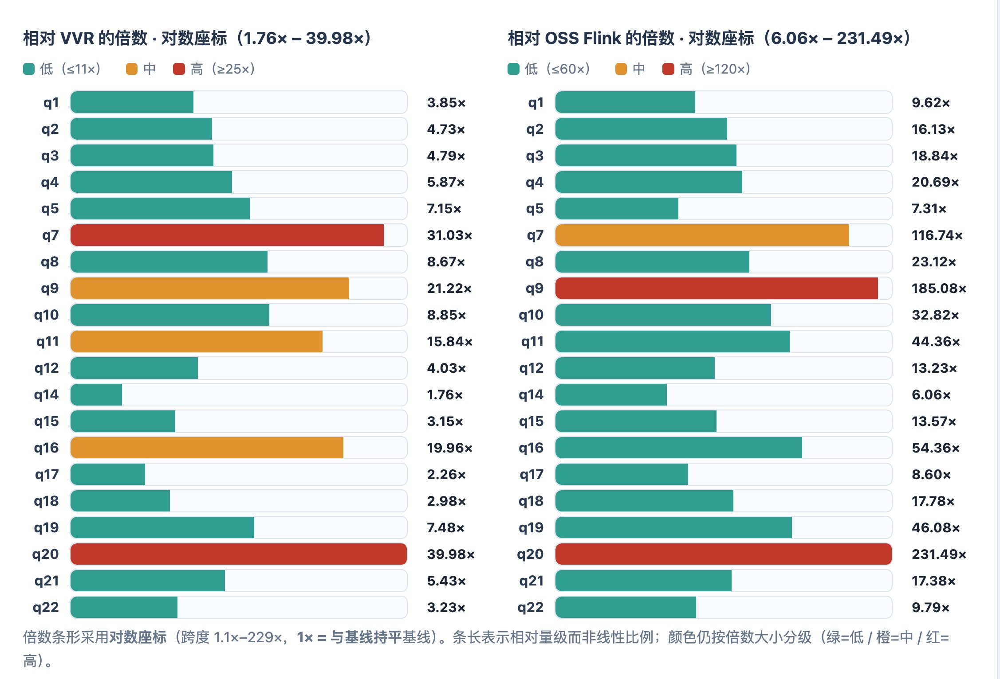
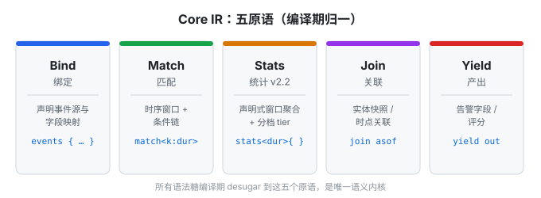

# warp-fusion

`warp-fusion` 是 WarpFusion 的 CLI / 工具 workspace，负责产出：

- `wfusion` — 引擎主二进制
- `wfgen` — 测试数据生成工具（含 `nexmark_pk` 基准工具链）
- `wfl` — 规则开发工具
- `wfadm` — 管理 CLI
- `wf-project-remote` — 远程项目加载库

变更记录见 [CHANGELOG.md](./CHANGELOG.md)。

运行、配置和 Admin API 使用文档见 [docs](./docs/)，其中 Admin API  
状态查询、在线 reload 和发布流程见 [docs/useage/cli/admin\_api.md](./docs/useage/cli/admin_api.md)。

## 价值与竞争力

`warp-fusion` 定位为**通用流处理引擎**，以 WFL 高层处理语义 DSL（五原语 `Bind` / `Match` / `Stats` / `Join` / `Yield`）表达规则，轻量化运行。

### 性能能力参照（NEXMark）

与 Flink 系**同方法论**对照（100M 事件、in-memory 源 + blackhole 汇、同型号云服务器）：

| 对照基线                         | 几何平均领先    | 算术平均领先 |
| ---------------------------- | --------- | ------ |
| Flink OSS（3×12 vCPU / 48GiB） | **24.3×** | 44.7×  |
| 阿里 VVR（8 CU / 32GiB 托管集群）    | **6.8×**  | 10.1×  |

在公开 NEXMark 对照中属**独一档**——其他现代引擎（Feldera 增量计算 2.2×、RisingWave 宣称 2–10× 但基准有争议）相对 Flink 仅 2–4× 量级改进。完整口径与逐查询数据见 [NEXMark PK 报告](https://github.com/wp-labs/wf-examples/blob/main/performance/nexmark_pk/NEXMARK_PK_REPORT.md)。

### WFL 表达能力

WFL 是面向「安全检测 + 实体行为分析」的专用 DSL，在这一类中表达力最强——高于 YARA-L / EQL / Sigma 一个量级；相对 SPL / KQL 等通用查询语言，差距已从「远弱」收窄到「通用函数库丰富度」这一设计边界。

- **五原语内核（Bind / Match / Stats / Join / Yield）**：所有语法糖编译期归一为唯一语义内核。既能写逐事件流式检测，也能写声明式窗口统计（`stats<dur> [group by] { 聚合 }` + 分档）。
- **检测表达力是核心差异化**：时序链 + OR 分支 + 双阶段匹配（实时求值 / 窗口关闭求值），缺失检测（A→NOT B）语义清晰；一等实体声明 `entity()` 驱动跨规则评分累加——SPL / KQL / YARA-L 在语言层都没有。
- **覆盖范围（v2.2 扩展）**：相较早期版本补齐哈希族、网络 `cidr_match`、多精度时间、对象 `merge`、HOP 跳窗、`anti` / 延迟触发 join、规则级 `let` 等 20+ 函数与语法；与 SPL Top50 高频函数对齐率 100%（50/50），并额外覆盖安全检测专有族。
- **诚实边界**：三角函数、行保留聚合（eventstats 类）等通用计算不在主战场，交下游 SIEM；分项可解释评分等为规划项，当前以单通道评分 + 条件表达式替代。

### 架构优势（为什么快）

| 杠杆               | 砍掉了什么                                                 |
| ------------------ | ---------------------------------------------------------- |
| **列式批式向量化** | 逐事件对象分配 + 解释器分发                                |
| **数据零拷贝**     | 消灭 Event→Record→DataRecord 多层拷贝                      |
| **内存精确控制**   | 窗口数据仅过期且被下游全部消费后才释放、数据预读总量设上限 |
| **Rust vs Java**   | 免去 Java 系引擎（Flink 等）的 JVM GC 停顿                 |
| **规则即规划**     | 运行期逐事件解释（Stats/Match 编译期定型为执行计划）       |

### 边界声明（重要）

上述领先&#x5728;**「引擎纯算力 / 单机内存」隔离维度**测得：`warp-fusion` 当前为**单机 8 核、纯内存、无 exactly-once / checkpoint / 分布式协调开销**。NEXMark 为合成基准，结论作**能力参照**而非生产 SLA 承诺；生产级容错、分布式与有状态一致性仍需补齐后方能对等比较。

## License

`warp-fusion` 及核心运行时采用 **Elastic License 2.0 (ELv2)**。

- **允许**：个人、研究、教学、非营利组织，以及企业**内部自用**（含部署、修改、嵌入自有产品）。
- **禁止**：将本软件作为**托管服务 / 产品对外提供**、销售本软件本身、或绕过授权限制。
- 任何超出上述免费范围的商业用途，需与版权人另行签署商业授权协议。

完整条款见 [LICENSE](./LICENSE)；版权归属 `Copyright (c) 2026 zuowenjian`。

> 注：ELv2 不属于 OSI 认证的开源协议（source-available），但允许企业内部商用。
